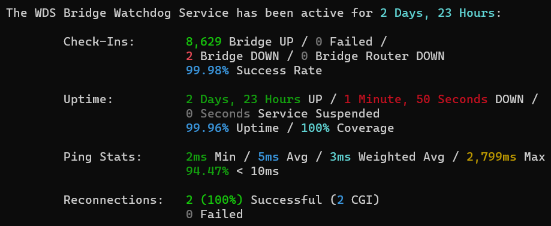

    <h1>WDS Bridge Watchdog Service</h1>
    
    
A NodeJS WDS Bridge Watchdog Program responsible for continuously monitoring a <a href="https://wikipedia.org/wiki/Wireless_distribution_system" target="_blank">WDS Bridge</a> and automatically attempting to re-establish it using an extendable API whenever needed.

